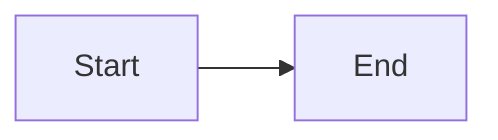
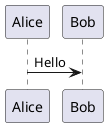

# Cera Spec Sample

This sample exercises every block type and inline element the editor must handle.

## Inline Formatting

Paragraph with **bold**, *italic*, ***bold-italic***, ~~strikethrough~~, `inline code`,
escaped \*asterisk\*, backslash \\, and an HTML entity &amp;.

Hard line break via two trailing spaces:  
New line after two spaces.

Hard line break via backslash:\
New line after backslash.

## Links and Images

Inline link: [Example](https://example.com "Title").

Autolink URL: <https://example.com>.

Autolink email: <user@example.com>.

Reference link: [reference][ref].

Collapsed reference: [ref].

Inline image: .

Reference image: ![Ref Alt][img].

## Headings

### ATX H3

#### ATX H4

##### ATX H5

###### ATX H6

Setext H1
==========

Setext H2
----------

## Lists

### Unordered (Tight)

- Apple
- Banana
- Cherry

### Unordered (Nested 3 Levels)

- Level 1
  - Level 2
    - Level 3

### Ordered

1. First
2. Second
3. Third

### Ordered Starting at Non-1

5. Fifth
6. Sixth

### Task List

- [x] Completed task
- [ ] Pending task
- [ ] Another pending

### Loose List (Blank Lines Between Items)

- First item

- Second item

- Third item

### Multi-Paragraph List Item

- This is the first paragraph of a list item.

  This is the second paragraph of the same item.

- Next item.

## Blockquotes

> Simple blockquote with **bold** and *italic*.

> Quote with a list:
> - Item A
> - Item B

> Nested quote:
>
> > Inner quote.
> >
> > > Triple-nested quote.

> Quote with code:
>
> ```python
> print("hello from a quote")
> ```

## Code

Inline: `dotnet run --project src/Cera`

```csharp
// Fenced with language
public record MarkdownBlock(string Content);
```

```
Fenced without language info.
```

    Indented code block (4 spaces).

```markdown
# Markdown inside a code fence
This **should not** be parsed as formatting.
```

## Diagrams





## Tables

### Basic Table

| Name  | Value | Note  |
|-------|------:|:-----:|
| Alpha |     1 | Left  |
| Beta  |     2 | Center|

### Table with Inline Formatting

| Feature       | Status          |
|---------------|-----------------|
| **Bold cell** | ~~removed~~     |
| `code cell`   | *italic cell*   |

## HTML Block

<details>
<summary>Collapsible Section</summary>
<p>HTML block content inside Markdown.</p>
</details>

<div class="custom">
  <p>Another HTML block.</p>
</div>

## Thematic Breaks

---

***

___

## Inline Extensions (UNSUPPORTED — negative cases)

The supported flavor is CommonMark + GFM. The markup below is **not** GFM and must render
as **literal text**, not formatting. These lines are negative/raw fidelity cases (Phase 7),
not features to implement.

Extra emphasis: ++inserted++ and ==marked==. Subscript: H~2~O. Superscript: E=mc^2^.

Emoji shortcodes: :thumbsup: and :smile:.

## Edge Cases

### Empty Heading

###

### Paragraph Immediately After Heading (No Blank Line)
Text right after heading.

### Consecutive Thematic Breaks

---
---
---

### Unicode Content

日本語の見出しとコンテンツ。Cześć! مرحبا 🎉

### Very Long Paragraph

Lorem ipsum dolor sit amet, consectetur adipiscing elit. Sed do eiusmod tempor incididunt ut labore et dolore magna aliqua. Ut enim ad minim veniam, quis nostrud exercitation ullamco laboris nisi ut aliquip ex ea commodo consequat. Duis aute irure dolor in reprehenderit in voluptate velit esse cillum dolore eu fugiat nulla pariatur. Excepteur sint occaecat cupidatat non proident, sunt in culpa qui officia deserunt mollit anim id est laborum.

### List Without Preceding Blank Line
- This list has no blank line before it
- Second item

## Reference-Style Links

This paragraph uses reference-style links: visit [Example][ref] or see the image below.

![Placeholder][img]

[ref]: https://example.com "Example Reference"

[img]: https://via.placeholder.com/200x80 "Reference Image"
